# 简历工坊 · Resume Editor

一个电脑端优先的浏览器简历编辑器。直接在简历预览中修改内容，切换版式、配色和字号，管理多份简历，再通过浏览器打印导出 PDF。

项目适合想自己调整简历排版、维护不同岗位版本的人，也可作为 Vue、TypeScript 和浏览器本地存储的学习示例。

> 首次打开显示虚构的示例简历。人物、学校、机构、联系方式和经历均为演示数据，不对应真实履历。项目没有账号系统或服务端同步，真实简历保存在使用者自己的浏览器中。

> **数据保存在浏览器本地，而不是项目文件夹或 GitHub 仓库。** 简历文字、照片和样式由当前浏览器的 IndexedDB 保存，不会上传到服务器。换浏览器、电脑或访问地址前，请在“我的简历”中点击“备份全部简历”，到新环境后再导入。

## 界面预览

以下截图来自本地运行的实际页面，使用独立浏览器会话中的虚构简历。姓名、联系方式、学校、公司和项目均为演示内容。

### 本次更新

原位富文本编辑与悬浮格式工具栏、55 种文字颜色、无序列表和段落间距；新增按需展开的链接输入、机构信息多行编辑、预览缩放与大预览，以及 24 套主题配色。

| 选中文字与浅色色板                                                  | 缩放与大预览                                                       | 清新浅色主题                                                          |
| ------------------------------------------------------------------- | ------------------------------------------------------------------ | --------------------------------------------------------------------- |
| 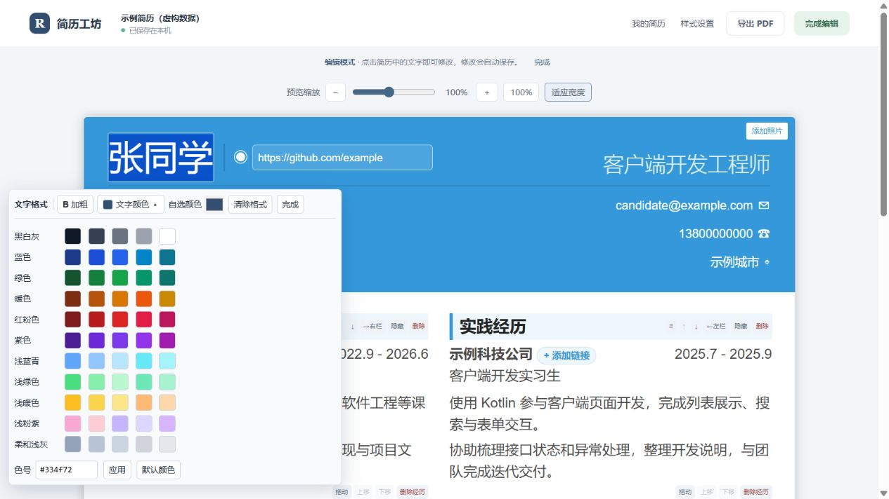 | 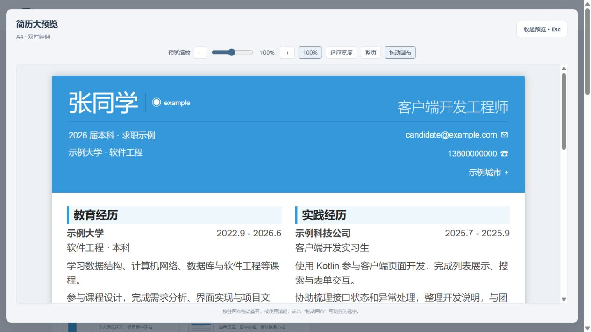 | 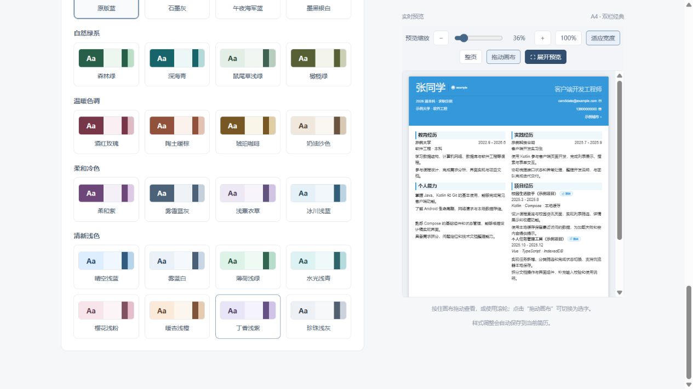 |

### 简历工作区

双栏经典布局，直接预览内容，项目标题旁可打开已设置的链接。

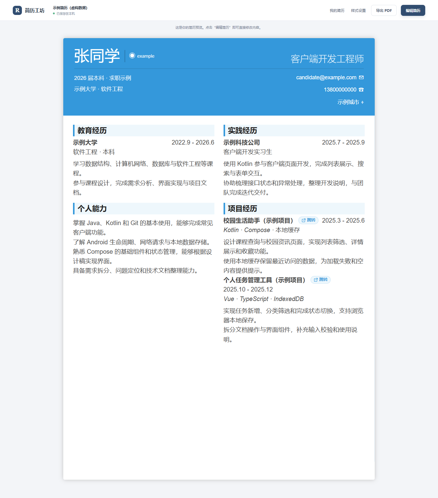

### 编辑、布局、配色与管理

点击图片可查看原图。

| 预览内编辑                                                                      | 布局选择与实时预览                                                                    |
| ------------------------------------------------------------------------------- | ------------------------------------------------------------------------------------- |
| 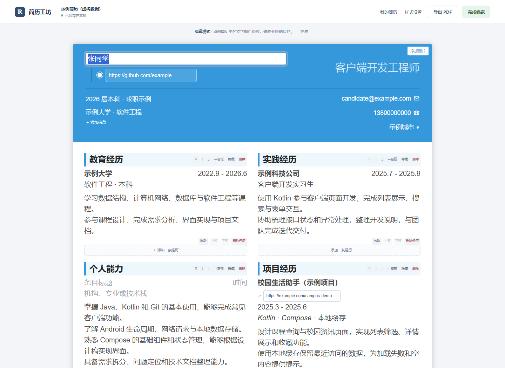 | 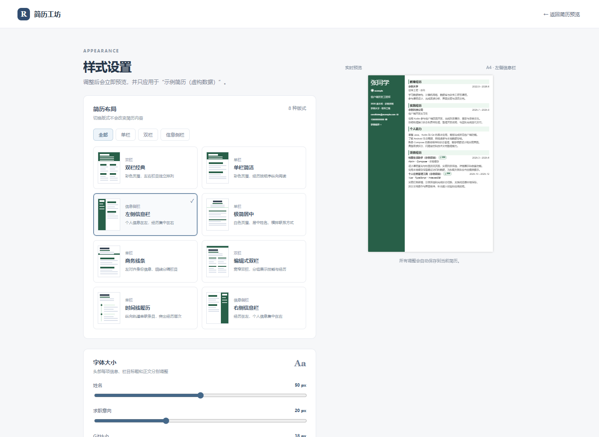 |
| 点选文字修改，设置个人主页和项目链接，调整栏目位置。                            | 十四种单栏、双栏和信息侧栏版式可筛选切换，并即时预览。                                |

| 字体与主题配色                                                           | 多份简历管理                                                                   |
| ------------------------------------------------------------------------ | ------------------------------------------------------------------------------ |
| 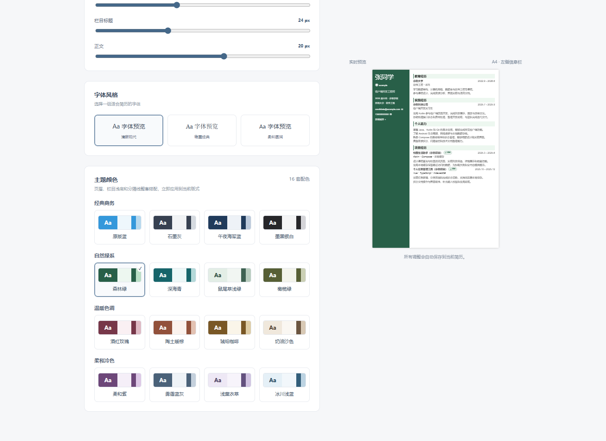 | 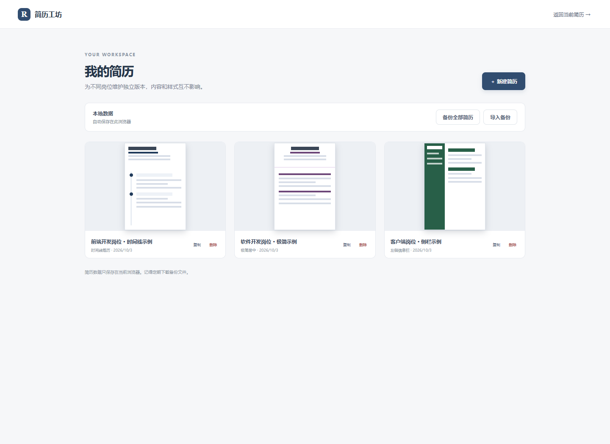 |
| 调整字号、字体风格和整套主题颜色。                                       | 为不同岗位保留独立版式，支持复制、改名及备份。                                 |

### 同一份虚构内容的不同版式

| 左侧信息栏 · 森林绿                                              | 极简居中 · 柔和紫                                                    | 时间线履历 · 午夜海军蓝                                                 |
| ---------------------------------------------------------------- | -------------------------------------------------------------------- | ----------------------------------------------------------------------- |
| 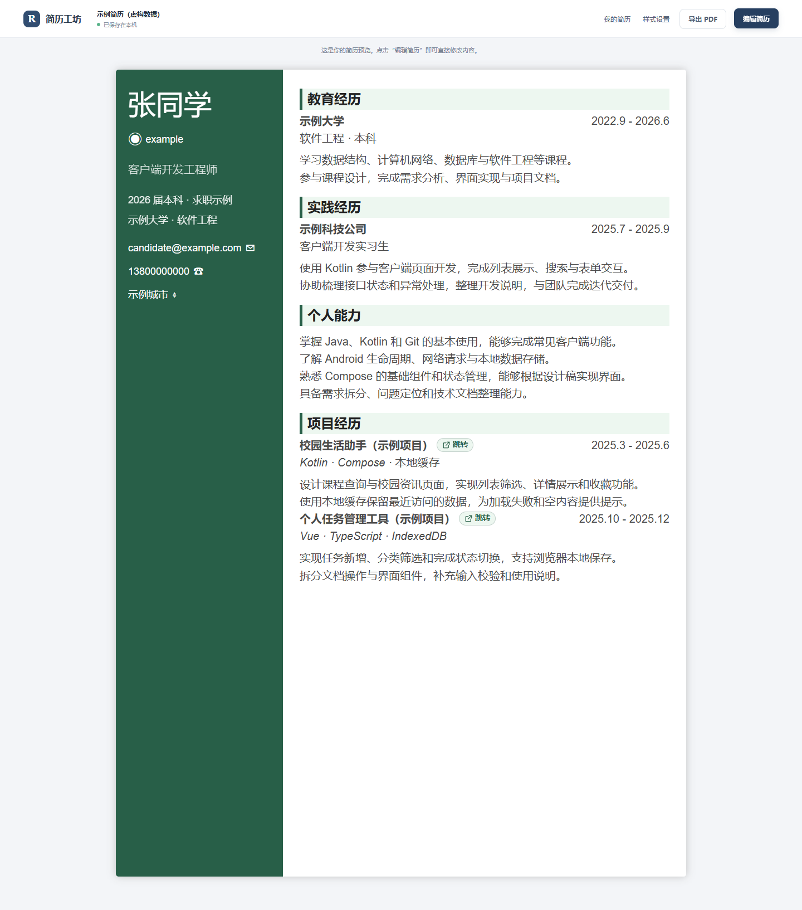 | 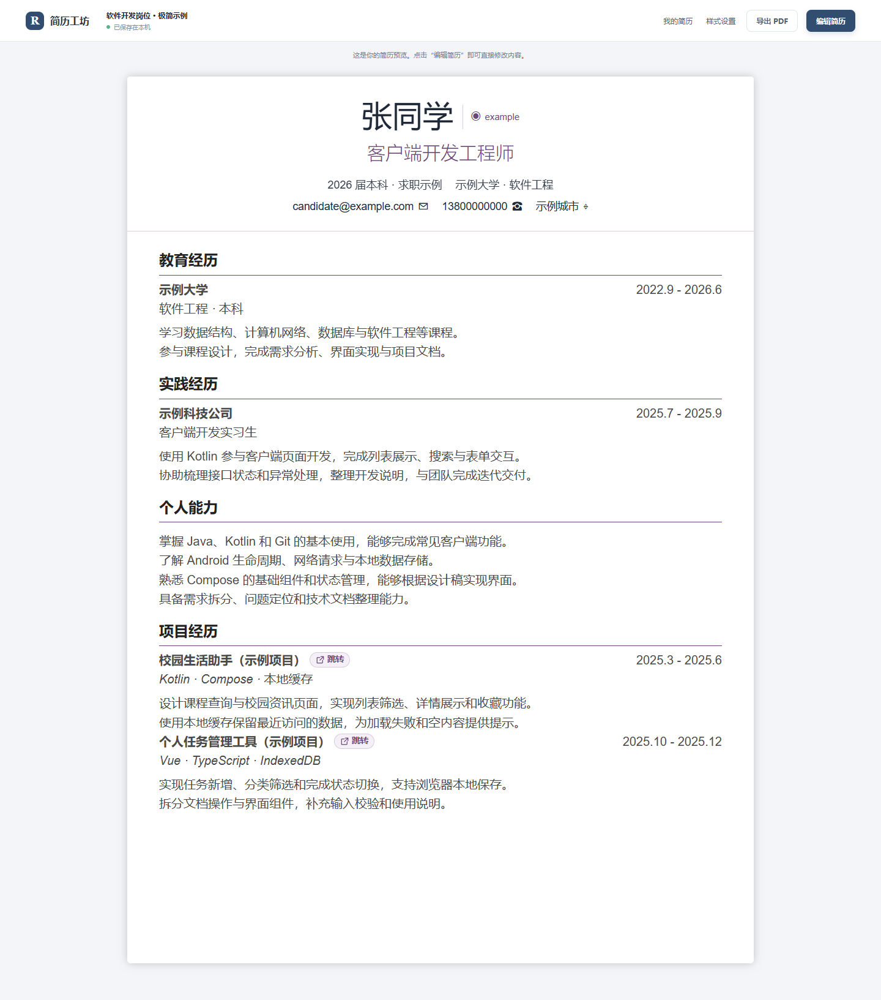 | 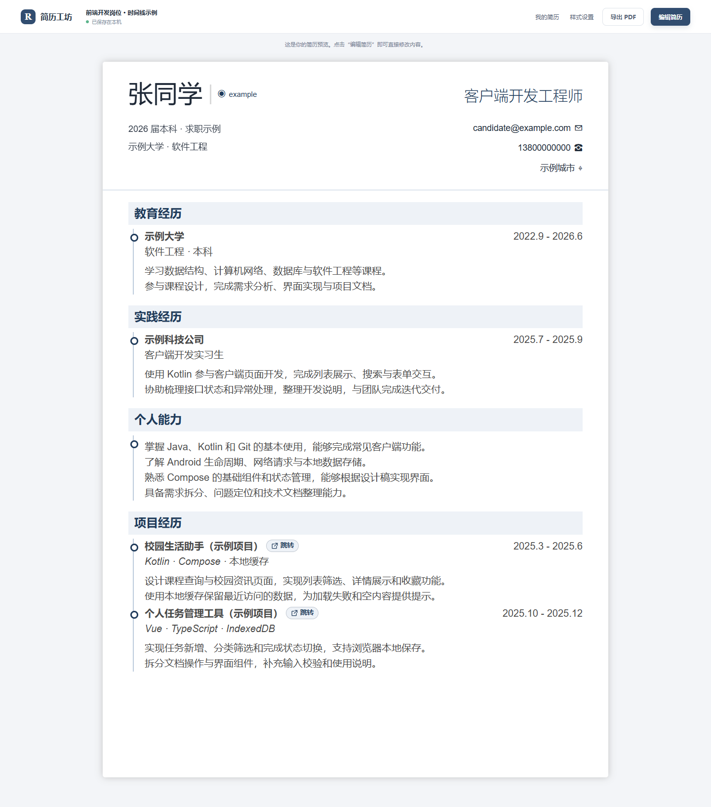 |

截图采集方式和展示范围见 [截图说明](docs/screenshots/README.md)。

## 能做什么

| 功能           | 使用方式                                                                     |
| -------------- | ---------------------------------------------------------------------------- |
| 预览内编辑     | 点击“编辑简历”，再点选姓名、联系方式、标题或正文                             |
| 8 种简历布局   | 单栏、双栏、左/右信息侧栏、极简、商务、编辑式和时间线                        |
| 24 套主题配色  | 页眉、文字、栏目浅底和分隔线整套搭配，包含清新浅色主题                       |
| 分项字号       | 姓名、求职意向、GitHub、邮箱、电话、城市、个人信息行、栏目标题和正文分别调整 |
| 栏目与条目管理 | 新增、隐藏、删除、拖拽排序；双栏可跨栏移动                                   |
| 链接与照片     | 修改个人主页和项目地址；预览模式点击跳转；照片在浏览器内压缩                 |
| 多份简历       | 新建、复制、改名和删除，为不同岗位保留独立内容与样式                         |
| 本地保存与备份 | 自动保存到 IndexedDB，支持全部文档及照片的 JSON 备份与合并导入               |
| PDF 导出       | 使用当前布局、颜色、字号和链接，映射到 A4 并自然分页                         |
| 保存保护       | 读取失败停止写回；保存失败可重试；标签页修订冲突时提供备份与重读入口         |

描述内容按输入的纯文本和换行显示。列表符号可以自行输入，也可以通过悬浮工具栏添加。

编辑时，经历标题旁的“添加链接”按钮会展开地址输入框；已有链接显示“修改链接”。输入后按 Enter 或点击其他位置保存并收起，清空地址可移除链接。项目、实践及其他经历条目均支持，观察模式显示可点击的“跳转”标签。

正文在简历原位置直接编辑并渲染，按内容自然展开，长内容通过页面滚动查看。编辑内核使用 [Tiptap Vue 3](https://tiptap.dev/docs/editor/getting-started/install/vue3)，首次编辑时按需加载。

### 预览缩放

“样式设置”右侧的实时预览提供缩放滑杆和加减按钮，范围 10%～200%；默认适应预览区域宽度，放大后可上下、左右滚动查看。切换布局、字体或配色时保留当前查看比例。

点击“展开预览”可在更大的窗口中查看细节；“整页”按当前简历的实际高度缩小到可见区域，“适应宽度”用于阅读正文。默认可按住画布拖动，也可切换到“选中文字”模式；链接仍可正常打开。点击“收起预览”或按 Escape 返回设置，小预览保留原来的查看位置。

主页工作区也提供相同控件，范围 25%～200%，预览与编辑共用同一缩放比例。“100%”恢复原尺寸，“适应宽度”随区域宽度调整。缩放仅控制屏幕查看，PDF 继续使用固定 A4 映射。

点击字段时保留原文字，直到富文本编辑器就绪再交接；字段容器、字号和段落间距保持一致，恢复焦点时保留滚动位置。

### 局部文字加粗与颜色

1. 点击“编辑简历”，在姓名、个人信息、栏目标题或经历中拖选需要强调的文字；也可以先点击字段，再在原位置选字。
2. 选中文字后，选区附近自动显示悬浮工具栏，可以“加粗”，打开“文字颜色”选择 55 种分组预设色，包含浅蓝青、浅绿、浅暖色、浅粉紫和柔和浅灰，或使用“自选颜色”。也可输入六位色号（如 `#2563eb`）或三位简写（如 `#f80`），点击“应用”；“默认颜色”只恢复模板文字色，保留加粗。支持 Ctrl/Cmd+B；没有选区时工具栏隐藏。
3. 文字直接显示加粗和颜色效果，点击悬浮工具栏的“完成”或点击其他位置提交。
4. “清除格式”恢复选中文字的模板默认样式；Escape 取消当前字段尚未提交的修改。

文字与局部格式一起保存，复制简历、JSON 备份和当前版式的 PDF 打印共用这些格式。旧简历没有格式字段时按原样显示。在已有格式中继续输入时，编辑内核沿用当前位置的格式。

支持直接输入 `**文字**` 的 Markdown 加粗快捷语法，也支持 Ctrl/Cmd+B。Ctrl/Cmd+Z 撤销，Ctrl/Cmd+Shift+Z 重做；正文 Enter 分段，Ctrl/Cmd+Enter 完成字段编辑。粘贴按纯文本处理，剪贴板没有文字时保留选区并提示，不导入网页 HTML 或正文图片。

正文仍是纯文本；局部样式以文字区间单独存储，只允许加粗和十六进制颜色。请使用当前版本编辑含格式的简历，旧版本无法保留这些新增字段。

### 项目描述的无序列表

进入编辑模式，选中项目描述的一段或多段文字，在悬浮工具栏点击“• 无序列表”，为每个非空段落添加圆点。选中的段落全部已有圆点时，再次点击可取消；混合选择只补缺失圆点，空行和已有加粗、颜色保留。其他经历正文也支持同一操作。

圆点作为正文保存，备份、复制和 PDF 打印沿用正文内容；不会自动给所有项目加圆点，也不自动改变 Enter 的换行行为。

### 正文段落间距

进入“样式设置 → 段落间距”，拖动滑杆或输入数值（0～24px，默认 6px），调整项目描述等正文中手动换行的段落与列表项之间的额外间隔。0px 恢复紧凑排列；长句自动折行的行距保持不变，原有空行继续保留。

设置立即预览，并保存到当前简历；复制、备份与 PDF 打印保留相同间距。旧文档没有此设置时使用默认 6px。

## 快速运行

### 环境

- Node.js `^22.18.0` 或 `>=24.12.0`，建议使用 Node.js 24。
- npm 与 Git。
- 桌面端 Chrome 或 Edge；其他浏览器的打印结果需要自行确认。

### 下载和启动

```sh
git clone https://github.com/summerpalace2/resume-editor.git
cd resume-editor
npm ci
npm run dev
```

打开终端显示的开发服务器地址，通常为 [http://localhost:5173](http://localhost:5173)。端口被占用时，以终端实际输出为准。

首次打开没有本地文档时，会自动创建示例简历。已有本地简历不会被示例覆盖。

### 一个完整使用示例

1. 打开“我的简历”，点击“新建简历”，或复制一份已有简历。
2. 进入工作区，点击“编辑简历”，填写姓名、求职意向和联系方式。
3. 在栏目下方添加经历，填写机构、项目名称、时间及正文；需要时添加或移动栏目。
4. 在项目标题旁填写链接；点击“完成编辑”后，使用“跳转”按钮打开它。
5. 进入“样式设置”，选择布局、主题和字体，调整各项字号，查看实时预览。
6. 返回工作区，确认保存状态显示“已保存在当前浏览器”。
7. 点击“导出 PDF”，按下方打印参数保存文件。
8. 回到“我的简历”，点击“备份全部简历”，留存可恢复的 JSON 文件。

示例内容包含虚构大学、客户端实习、个人能力、校园助手和任务管理项目，用于展示编辑效果。替换内容即可开始制作自己的简历。

## 布局与配色

| 布局       | 排版特点                         |
| ---------- | -------------------------------- |
| 双栏经典   | 彩色页眉，左右栏目独立排列       |
| 单栏简洁   | 彩色页眉，正文纵向展开           |
| 左侧信息栏 | 左侧个人信息，右侧正文           |
| 极简居中   | 居中姓名，横排联系方式，细线分隔 |
| 商务线条   | 左对齐身份，页眉底线，单栏正文   |
| 编辑式双栏 | 轻量页眉，宽窄不同的独立左右栏   |
| 时间线履历 | 栏目内用轨道和节点串联条目       |
| 右侧信息栏 | 左侧正文，右侧个人信息           |

配色分为经典商务、自然绿系、温暖色调、柔和冷色和清新浅色。浅色页眉主题使用深色文字，深色页眉使用浅色文字。

“清新浅色”包含晴空浅蓝、雾蓝白、薄荷浅绿、水光浅青、樱花浅粉、暖杏浅橙、丁香浅紫和珍珠浅灰。在“样式设置 → 主题颜色”中选择，实时预览、版式缩略图及 PDF 共用同一套配色；白色页眉版式保留白底，以强调色、栏目底色和分隔线体现主题。

切换布局保留文字、照片、链接、字号和已指定的左右栏归属。编辑式双栏默认将教育、技能、荣誉归入左侧，经历与项目归入右侧；手动指定的位置优先。

## 导出 PDF

导出使用浏览器打印对话框，并非直接下载生成的 PDF 文件。

推荐设置：

- 目标：另存为 PDF。
- 纸张：A4。
- 边距：无。
- 缩放：100%。
- 背景图形：开启。
- 浏览器页眉和页脚：关闭。

长内容保留字号并自然分页；编辑控件在打印中隐藏。信息侧栏在续页重复背景，个人主页和项目地址保留为链接。

当前使用本机字体回退，不同系统或浏览器可能出现分页差异。打印前请检查预览。固定样本和检查步骤见 [PDF 检查约定](docs/pdf-checklist.md)。

## 数据在哪里

简历、外观设置和照片保存到当前站点、当前浏览器的 IndexedDB（数据库名为 `resume-studio`），不在项目文件夹内，也不会随 Git 提交上传。项目代码没有简历上传或跨设备同步接口。

- 更换浏览器、电脑、浏览器配置或站点地址后，可能看到另一份本地工作区；站点地址按协议、主机和端口区分，例如 `localhost:5173` 与 `127.0.0.1:5174` 不共用记录。
- 只移动项目文件夹不会迁移简历数据；只要继续使用同一浏览器配置和站点地址，原本的浏览器记录仍在。跨环境迁移请使用 JSON 备份和导入。
- 清除站点数据会移除本地记录，请提前下载备份。
- 备份包含全部简历及照片，导入时合并到现有集合，冲突文档 ID 会重新生成。
- 读取失败时不创建可写回的临时空简历，界面提供重试入口。
- 保存失败时保留页面中的修改，可重试保存或下载备份。
- 另一标签页已保存新内容时，当前页面停止覆盖，先备份自己的修改，再重新读取。
- 关闭页面前以“已保存在当前浏览器”为准，退出时的异步写入不保证完成。

更新项目后请关闭旧版本页面，再重新打开。仓库只包含程序、文档和虚构样本；个人备份、导出文件及本地环境配置不应提交。

## 技术栈与目录

Vue 3 · TypeScript · Pinia · Vue Router · Vite · IndexedDB

```text
src/
├── types.ts               文档类型契约
├── domain/                完整校验、工厂、字段修改与排序
├── data/                  示例、布局、配色与字号登记
├── stores/                工作区状态和统一修改动作
├── storage/               数据库、备份与串行保存队列
├── services/              照片处理和编辑生命周期
├── composables/           编辑编排、响应式样式
├── components/            通用输入和预览入口
├── templates/             共用画布、页眉/栏目/条目及打印样式
└── views/                 工作区、管理和设置页面
```

页面通过统一动作修改工作区，画布通过事件提交文档副本。保存队列防抖并串行写入，存储层在同一事务内比较修订后提交。

继续阅读：

- [文件、关键函数与参数指南](docs/code-guide.md)
- [架构评审与修复记录](docs/architecture-review.md)
- [架构修复执行计划](docs/implementation-plan.md)

## 开发命令

```sh
npm run dev          # 开发服务器
npm run type-check   # Vue / TypeScript 类型检查
npm run lint         # 静态规则，零警告
npm run format       # 格式化
npm run format:check # 检查格式
npm run build        # 类型检查与生产构建，输出到 dist/
npm run preview      # 本地查看生产构建
npm run check        # lint、格式检查、类型检查与生产构建
```

GitHub Actions 配置运行同一套静态检查，云端结果以仓库的 Actions 页面为准。

部署静态构建时，需要支持 History 路由回退到 `index.html`。默认配置按站点根路径运行，部署到子路径前需调整资源路径与路由基址。

## 当前范围

- 电脑端优先，未专门设计手机端编辑体验。
- 没有账号、服务端存储或跨设备自动同步。
- 保存仍使用完整工作区快照。
- 静态检查和构建已通过；本轮架构重构后的存储故障恢复及浏览器/PDF 回归尚未验收。
- 当前仓库尚未提供许可证文件，公开展示不等同于授予额外使用许可。

## 参考

版式灵感参考 [Harvard Extension School 的简历样例](https://cdn-careerservices.fas.harvard.edu/wp-content/uploads/sites/161/2025/09/HES-Resume-samples-combined.pdf)、[Europass CV 结构说明](https://europass.europa.eu/en/create-europass-cv)、[Canva 简历分类](https://www.canva.com/resumes/templates/)、[Overleaf 极简模板](https://www.overleaf.com/latex/templates/latex-resume-template/ngdmzkwsbgmd)、[经典简历](https://www.overleaf.com/latex/templates/classic-clean-latex-cv-template/gfcvcxcftbsp) 和 [时间线简历](https://www.overleaf.com/latex/templates/curriculum-vitae-timeline-slash-cv/bsbyzcmxmvvq)。实现借鉴通用排版特征，没有复制第三方模板素材。

架构评审参考 [Reactive Resume](https://github.com/reactive-resume/reactive-resume)、[OpenResume](https://github.com/xitanggg/open-resume) 及 Vue/Pinia 官方文档，详细比较保留在评审记录中。
