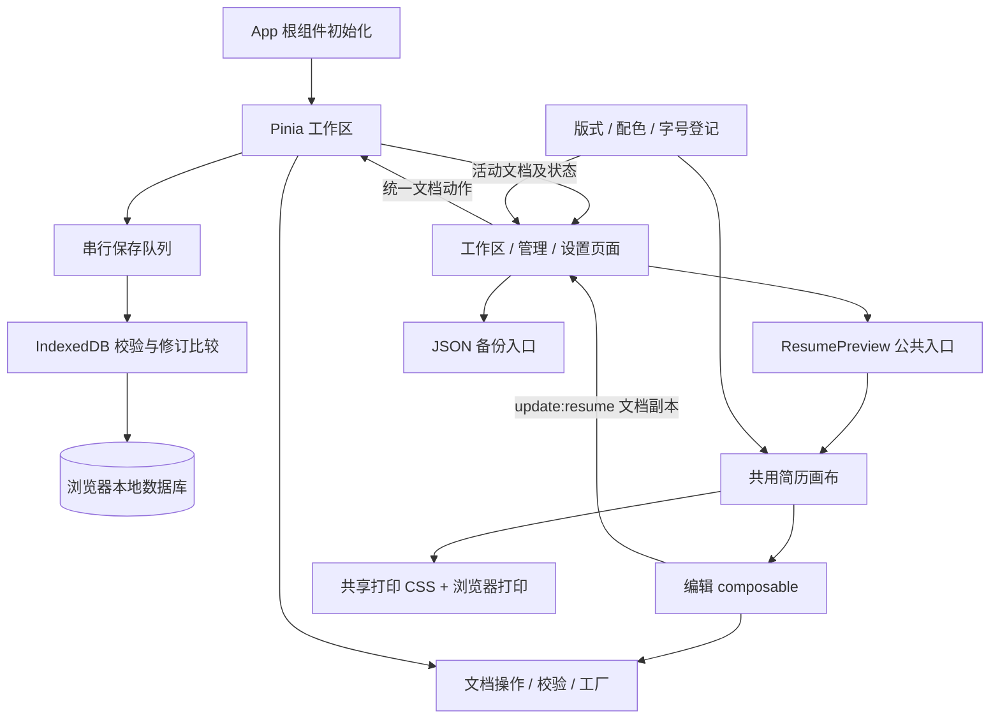

# 架构评审与改进顺序

评审日期：2026-10-03。初次评审范围为源码、构建配置、数据与导出路径，以及公开项目的架构文档。第 4 节保留初次评审发现，描述的是修复前状态；当前修复实现见第 7 节。没有将静态检查当成运行时故障注入或跨浏览器验证。

## 1. 判断

**现有架构适合当前目标，可以继续演进。本轮已实现完整文档校验、写回保护、保存队列与共用画布拆分，运行时故障及 PDF 回归仍需单独验证。**

当前产品是电脑优先、单个浏览器本地保存的简历编辑器，有十四种版式、二十四套配色和三类页面。Vue 3 + TypeScript + Pinia + IndexedDB 的组合能承载这些职责。初次评审发现的画布职责集中和编辑时间规则不一致，已按第 7 节的边界拆分与统一。

当前阶段保留单个 Vite 应用，按数据契约、文档操作、浏览器能力和展示组件逐步收拢职责。服务端、账号系统及多包仓库应由后续明确的产品需求驱动。

## 2. 对照依据

| 参考                                                                                                                                                                                                 | 查阅到的做法                                                                    | 本项目的判断                                                                |
| ---------------------------------------------------------------------------------------------------------------------------------------------------------------------------------------------------- | ------------------------------------------------------------------------------- | --------------------------------------------------------------------------- |
| [Reactive Resume 仓库](https://github.com/reactive-resume/reactive-resume)，GitHub 页面约 43.7k stars                                                                                                | 多模板、样式配置、导入与导出                                                    | 关注数据与版式的分离、模板扩展的边界                                        |
| [Reactive Resume 架构说明](https://docs.rxresu.me/contributing/architecture)                                                                                                                         | schema、纯领域逻辑、PDF 与界面分别拥有明确职责；领域包避免 DB、HTTP 和 DOM 依赖 | 本项目已经分出 types、storage、store 和模板；可进一步把文档操作从画布中提取 |
| [OpenResume 仓库及项目说明](https://github.com/xitanggg/open-resume)，GitHub 页面约 8.9k stars                                                                                                       | 浏览器本地运行、集中状态；表单与简历展示分别组织；使用 React-pdf 渲染 PDF       | 本地保存的方向有成熟先例；当前浏览器打印可继续使用，需持续检查实际分页      |
| [Vue 状态管理指南](https://vuejs.org/guide/scaling-up/state-management.html)                                                                                                                         | 新应用推荐使用 Pinia 管理共享状态                                               | 当前跨页面共享简历集合和当前选择，使用 Pinia 合理                           |
| [Vue Props 单向数据流](https://vuejs.org/guide/components/props.html#one-way-data-flow)                                                                                                              | 子组件通过事件通知父组件修改，避免隐蔽地修改父状态                              | 共用画布的“克隆 → 修改 → 发出事件”边界清楚                                  |
| [Pinia 状态文档](https://pinia.vuejs.org/core-concepts/state.html#accessing-the-state)                                                                                                               | 允许直接修改 store，也允许 v-model 绑定                                         | 设置页的直接绑定本身符合 Pinia 用法；本项目应统一修改时间、校验及保存语义   |
| [Vue Composables](https://vuejs.org/guide/reusability/composables.html)、[Vue Style Guide](https://vuejs.org/style-guide/)、[TypeScript strict](https://www.typescriptlang.org/tsconfig/strict.html) | 按职责封装可复用逻辑，遵守组件约定，使用严格类型检查                            | 当前已开启严格检查；复杂编辑逻辑适合渐进拆分，并补充静态规则                |

热度数据为查阅时页面显示的近似值。这里比较的是产品规模和职责边界；各参考项目的技术栈和部署目标不同，下面的改进顺序是基于本项目源码作出的判断。

## 3. 当前数据流

合理的部分：

- 数据契约不依赖页面；文档保存包含内容、照片、版式和外观。
- 模板不读取 Pinia 或 IndexedDB；父页面接收修改事件后更新工作区。
- 版式与配色集中登记，画廊、缩略图、预览及导入校验共用定义。
- 左右栏独立分组，文档保留原始索引及显式归属，支持排序和切换布局。
- 打印样式独立、最后加载；屏幕响应式规则限定为 screen。
- IndexedDB 的清空与重写处于同一个事务中，失败可整体回滚。

## 4. 初次评审发现（修复前状态）

### P1：备份的运行时校验不完整

位置：`src/storage/backup.ts` 的 `isResumeDocument`，`src/data/typography.ts` 的 `hasValidHeaderTypography`。

目前只检查文档外层、版式、配色与可选头部字号。没有完整检查 profile 的字段、sections 中每个栏目及 entries、基础字号、font 和 updatedAt。TypeScript 类型断言不会验证用户导入的 JSON。无效的栏目或条目可能通过入口，随后在画布分组、字段读取或排序时出错。

建议：增加统一的文档校验入口，校验整个层级及数值范围；对旧版本的缺省字段先作显式兼容处理。可先用现有 TypeScript 编写小型校验器；随着字段和迁移增多，再判断是否引入 schema 库。

### P1：读取失败后的临时文档缺少写回保护

位置：`src/stores/resumes.ts` 的 `initialize` 错误分支及深度监听；`src/storage/database.ts` 的 `saveWorkspace`。

读取失败时 ready 被设为 true，并创建空白文档。深度监听后续允许保存，而保存函数会清空并重写整个文档集合。若读取错误是暂时的，存储随后恢复，临时集合存在覆盖原有集合的风险。原子事务保障写入一致性，不能判断这个快照是否来源于成功读取。

建议：把“页面可展示”和“允许写回已成功读取的工作区”分开。读取失败时保留恢复/重试路径，临时文档不能直接覆盖未知的已有集合。

### P2：自动保存的收尾与完成状态需要明确

位置：`src/stores/resumes.ts` 的 350ms 防抖监听。

连续输入会合并保存，适合当前规模；但没有显式 flush，页面在防抖结束前关闭时，最后一段修改可能未写入。已有异步保存和新一轮修改重叠时，也没有修订号防止旧回调把状态显示为 saved。每次保存还会克隆并重写全部文档，照片和简历数量增加后成本会增长。

建议：收拢保存调度，提供可等待的 flush，区分已保存与待保存修订；离开页面前尽早处理待保存内容。退出钩子中的异步 IndexedDB 写入不能当成绝对保证。达到明显规模瓶颈后，再考虑按文档增量保存。

### P2：编辑入口混用，修改时间更新不一致

位置：`src/views/ResumeSettings.vue` 的基础字号与字体 v-model；`src/views/ResumeLibrary.vue` 的名称 v-model；`src/views/ResumeWorkspace.vue` 的 `updateResume`。

画布提交副本时会刷新 updatedAt，选择模板、主题及独立头部字号也会刷新时间。但是基础字号、字体风格和管理页名称直接修改字段，没有同步刷新 updatedAt。数据仍由深度监听保存，管理页的日期与排序却可能滞后。

建议：增加统一的文档修改动作，例如 `updateAppearance`、`renameResume` 与 `replaceResume`，集中处理时间、校验和后续保存语义。这样便于后来增加撤销及变更记录。直接修改 Pinia 状态不是违规，问题是本项目的附带规则没有统一。

### P2：共用画布的职责较多，名称已过时

位置：`src/templates/two-column/TwoColumnTemplate.vue`。

评审前约 782 行，同时处理链接解析、侧栏测量、字段修改、栏目和条目排序、照片压缩，以及全部版式的渲染。共用一套画布有助于同步编辑行为，但继续增加交互会提高阅读和修改成本。历史文件路径也容易让维护者误以为只支持双栏。

建议按顺序拆分：

1. 将不依赖 Vue/DOM 的文档修改与排序操作放到领域模块。
2. 将 URL 解析与照片处理移到明确命名的工具或浏览器服务。
3. 将需要响应式状态或生命周期的编排封装为 composable。
4. 将页眉、栏目和条目拆成展示组件，继续保持 props/emit 边界。
5. 将共用入口改为能表达职责的 `ResumeCanvas.vue`，同步修改引用。

这是一组后续渐进改进，本次注释没有实施移动或重命名。

### P2：主题校验存在遗留的第二份定义

位置：`src/data/defaultResume.ts` 和 `src/data/palettes.ts` 各自导出 `isAccentChoice`。

前者只识别旧四主题，当前未使用；后者识别十六主题，当前备份导入使用后者。两份同名导出容易被误用，也与统一登记表的约定冲突。源码已给遗留函数标注弃用说明。

建议：后续移除未使用的旧判断，正式校验统一依赖登记表；新增版式和主题时检查类型联合与登记内容是否同步。

### P3：工程规则和环境边界需要落到可执行约定

当前已有 TypeScript strict、未使用变量检查和 Prettier。当前项目没有 ESLint 配置、CI 配置或位于项目内的固定回归集；此前的浏览器/PDF诊断位于外部工作目录，尚未成为随项目维护的检查入口。

建议后续配置 Vue 与 TypeScript 的 lint 规则，并把关键文档操作、旧备份兼容及典型 PDF 样本纳入按需运行的检查。按“数据边界 → 保存 → 编辑操作 → PDF”排列优先级。

还需明确两个使用边界：

- 当前没有跨标签页协调，同源的两个编辑页各自维护全量快照；交替写入可能覆盖另一页的新内容。当前按单标签页编辑使用，若需要多标签页，再加入修订检查或协调机制。
- PDF 依赖浏览器打印及本机字体回退，当前实际导出检查基于 Windows Chrome。精确的跨引擎分页或一致字体需求出现后，应先确定字体资源及导出接口，再评估专用 PDF 渲染器。

## 5. 原建议的执行顺序

| 阶段 | 目标                    | 完成标准                                                 |
| ---- | ----------------------- | -------------------------------------------------------- |
| 1    | 完整校验与读取失败保护  | 无效备份不能进入工作区；读取失败的临时数据不能覆盖旧数据 |
| 2    | 文档更新与保存动作统一  | 名称、外观、内容修改都刷新时间；保存状态对应明确修订     |
| 3    | 收拢领域操作并拆分画布  | 文档操作可独立阅读，展示组件保留清晰事件边界             |
| 4    | 工程检查与 PDF 样本固定 | 可重复检查旧备份、排序、保存及各版式分页                 |

## 6. 本次注释约定

- 文件头说明模块作用及依赖边界。
- 关键函数说明输入、输出、副作用、失败处理；简单包装函数使用短注释。
- 关键参数说明单位、索引范围、稳定 ID、缺省值和兼容要求。
- 注释记录当前事实；存在的不足在评审中列出，不写成已经提供的能力。
- package.json、package-lock.json 和 tsconfig.json 的作用放在文件指南中，保持 JSON 格式。

详细文件与参数地图见 [代码阅读指南](code-guide.md)。

## 7. 本轮修复实现

| 原问题                       | 当前实现                                                                                                                                         |
| ---------------------------- | ------------------------------------------------------------------------------------------------------------------------------------------------ |
| 不完整的运行时校验           | `domain/validation.ts` 逐层解析 profile、外观、栏目、条目、照片及时间；检查字号范围和作用域内的重复 ID。备份和数据库读取/写入共用同一入口。      |
| 读取失败的临时数据覆盖旧记录 | `canPersist` 单独保护写回权限；失败只进入恢复界面，不创建临时空简历，原数据库保留，提供重试。                                                    |
| 保存竞态与防抖收尾           | `storage/saveQueue.ts` 串行写入，以 dirty/committed 修改序号更新状态；提供可等待 flush，失败保留待保存快照。完成编辑、路由切换和导出前主动保存。 |
| 不同编辑入口的时间规则不一致 | 所有页面使用 `replaceResume`、`renameResume`、`updateAppearance`、`selectTemplate` 等动作，集中校验、更新时间和调度。                            |
| 大画布和旧名称               | 入口更名为 `ResumeCanvas.vue`，分出 Header/Section/Entry 组件；文档规则、链接、照片、响应式编排分别移入 domain、services、composables。          |
| 重复主题判断                 | 移除 defaultResume 中未使用的旧判断，完整主题校验只依赖 palettes 登记表。                                                                        |
| 工程检查缺少入口             | ESLint 10 + Vue/TypeScript 推荐规则、Prettier、`npm run check`；domain 配置依赖边界规则；提供 GitHub Actions 静态检查配置。                      |
| 跨标签页的旧快照覆盖         | settings 仓库增加 workspaceRevision，旧库缺省为 0。保存事务内先比较再 clear/put；冲突时停止写入，保留当前内存数据供备份/重读。                   |
| PDF 样本不随项目维护         | 项目内固定正常、大字号照片、多页样本，每组覆盖十四种版式；检查路径见 `pdf-checklist.md`。                                                        |

### 保留的边界

- 保存仍采用完整工作区快照，适合当前规模；按文档增量保存属于出现规模瓶颈后的优化。
- 修订冲突保护要求其他编辑页面也使用本轮版本；老版本页面不了解修订协议，更新后应关闭旧页面并重新打开。
- 关闭浏览器时的异步写入不能绝对保证完成。后台切换主动请求保存，未保存时触发浏览器离开确认。
- 字体仍使用本机回退，PDF 仍由浏览器打印。未在本轮重跑浏览器/PDF 回归及存储故障注入；此前结果不能替代新实现的运行时证据。
- Actions 配置运行静态检查，发布后的云端状态以仓库 Actions 页面为准。自动化应用测试没有在本轮新增或运行。

检查记录与文件职责以 [代码阅读指南](code-guide.md) 和 [执行计划](implementation-plan.md) 为准。
